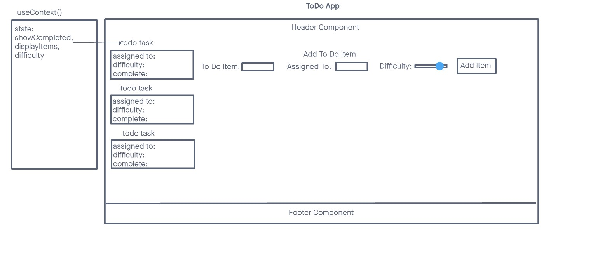
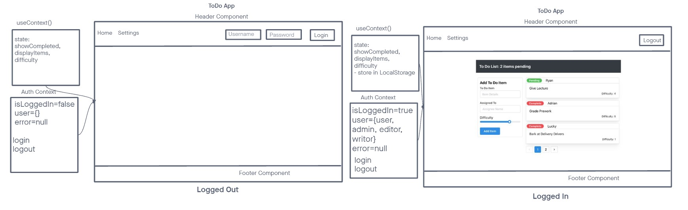

# Todo App

In **Phase 1**, we’re going to perform some refactoring of a Todo application built by another team. This application mixes application state and user settings at the top level and passes things around. It was a good proof of concept, but we need to make this production ready.

In **Phase 2**, we’re going to extend the functionality of our application by allowing the user to make some decisions on how they would like the application to function. Specifically, we’ll let them make changes to 2 settings.

**To Do List Manager Phase 3**: Adding security and access controls to the application.

In this final phase, we’ll be requiring that users be logged in, in order to see the to do items. Additionally, based on their user type, they will be allowed (or denied) to perform actions such as editing or deleting them.

## Collaboration

- Demo code/video

- Reece

- Ike

## Links and Resources

- [GitHub Actions CI/CD](https://github.com/KaedenOC/todo-app/actions)

- [Sandbox Lab 31](https://codesandbox.io/p/github/KaedenOC/todo-app/context-settings?workspaceId=6d0a53bd-a69d-4182-88d0-5418dc523e44)

- [Sandbox Lab 32](https://codesandbox.io/p/github/KaedenOC/todo-app/context-methods2?layout=%257B%2522sidebarPanel%2522%253A%2522EXPLORER%2522%252C%2522rootPanelGroup%2522%253A%257B%2522direction%2522%253A%2522horizontal%2522%252C%2522type%2522%253A%2522PANEL_GROUP%2522%252C%2522id%2522%253A%2522ROOT_LAYOUT%2522%252C%2522panels%2522%253A%255B%257B%2522type%2522%253A%2522PANEL_GROUP%2522%252C%2522direction%2522%253A%2522horizontal%2522%252C%2522id%2522%253A%2522EDITOR%2522%252C%2522panels%2522%253A%255B%257B%2522type%2522%253A%2522PANEL%2522%252C%2522panelType%2522%253A%2522TABS%2522%252C%2522id%2522%253A%2522cljht6jmo01av356mudisaqr0%2522%257D%255D%252C%2522sizes%2522%253A%255B100%255D%257D%252C%257B%2522type%2522%253A%2522PANEL_GROUP%2522%252C%2522direction%2522%253A%2522horizontal%2522%252C%2522id%2522%253A%2522DEVTOOLS%2522%252C%2522panels%2522%253A%255B%257B%2522type%2522%253A%2522PANEL%2522%252C%2522panelType%2522%253A%2522TABS%2522%252C%2522id%2522%253A%2522cljht6jmo01ax356mzdgn0is4%2522%257D%255D%252C%2522sizes%2522%253A%255B100%255D%257D%255D%252C%2522sizes%2522%253A%255B50%252C50%255D%257D%252C%2522tabbedPanels%2522%253A%257B%2522cljht6jmo01av356mudisaqr0%2522%253A%257B%2522tabs%2522%253A%255B%257B%2522id%2522%253A%2522cljht6jmn01au356mootmw58a%2522%252C%2522mode%2522%253A%2522permanent%2522%252C%2522type%2522%253A%2522FILE%2522%252C%2522filepath%2522%253A%2522%252FREADME.md%2522%252C%2522state%2522%253A%2522IDLE%2522%257D%255D%252C%2522id%2522%253A%2522cljht6jmo01av356mudisaqr0%2522%252C%2522activeTabId%2522%253A%2522cljht6jmn01au356mootmw58a%2522%257D%252C%2522cljht6jmo01ax356mzdgn0is4%2522%253A%257B%2522tabs%2522%253A%255B%257B%2522id%2522%253A%2522cljht6jmo01aw356mbj6p986n%2522%252C%2522mode%2522%253A%2522permanent%2522%252C%2522type%2522%253A%2522TASK_PORT%2522%252C%2522taskId%2522%253A%2522start%2522%252C%2522port%2522%253A3000%252C%2522path%2522%253A%2522%252F%2522%257D%255D%252C%2522id%2522%253A%2522cljht6jmo01ax356mzdgn0is4%2522%252C%2522activeTabId%2522%253A%2522cljht6jmo01aw356mbj6p986n%2522%257D%257D%252C%2522showDevtools%2522%253Atrue%252C%2522showSidebar%2522%253Atrue%252C%2522sidebarPanelSize%2522%253A15%257D)

- [Sandbox Lab 33](https://codesandbox.io/p/github/KaedenOC/todo-app/auth?layout=%257B%2522sidebarPanel%2522%253A%2522EXPLORER%2522%252C%2522rootPanelGroup%2522%253A%257B%2522direction%2522%253A%2522horizontal%2522%252C%2522type%2522%253A%2522PANEL_GROUP%2522%252C%2522id%2522%253A%2522ROOT_LAYOUT%2522%252C%2522panels%2522%253A%255B%257B%2522type%2522%253A%2522PANEL_GROUP%2522%252C%2522direction%2522%253A%2522horizontal%2522%252C%2522id%2522%253A%2522EDITOR%2522%252C%2522panels%2522%253A%255B%257B%2522type%2522%253A%2522PANEL%2522%252C%2522panelType%2522%253A%2522TABS%2522%252C%2522id%2522%253A%2522cljhyk3gr00sm356mcjmww8xk%2522%257D%255D%252C%2522sizes%2522%253A%255B100%255D%257D%252C%257B%2522type%2522%253A%2522PANEL_GROUP%2522%252C%2522direction%2522%253A%2522horizontal%2522%252C%2522id%2522%253A%2522DEVTOOLS%2522%252C%2522panels%2522%253A%255B%257B%2522type%2522%253A%2522PANEL%2522%252C%2522panelType%2522%253A%2522TABS%2522%252C%2522id%2522%253A%2522cljhyk3gr00so356mir3wa389%2522%257D%255D%252C%2522sizes%2522%253A%255B100%255D%257D%255D%252C%2522sizes%2522%253A%255B50%252C50%255D%257D%252C%2522tabbedPanels%2522%253A%257B%2522cljhyk3gr00sm356mcjmww8xk%2522%253A%257B%2522tabs%2522%253A%255B%257B%2522id%2522%253A%2522cljhyk3gr00sl356mp0m79nf0%2522%252C%2522mode%2522%253A%2522permanent%2522%252C%2522type%2522%253A%2522FILE%2522%252C%2522filepath%2522%253A%2522%252FREADME.md%2522%257D%255D%252C%2522id%2522%253A%2522cljhyk3gr00sm356mcjmww8xk%2522%252C%2522activeTabId%2522%253A%2522cljhyk3gr00sl356mp0m79nf0%2522%257D%252C%2522cljhyk3gr00so356mir3wa389%2522%253A%257B%2522tabs%2522%253A%255B%257B%2522id%2522%253A%2522cljhyk3gr00sn356mrapxyt8x%2522%252C%2522mode%2522%253A%2522permanent%2522%252C%2522type%2522%253A%2522TASK_PORT%2522%252C%2522taskId%2522%253A%2522start%2522%252C%2522port%2522%253A3000%252C%2522path%2522%253A%2522%252F%2522%257D%255D%252C%2522id%2522%253A%2522cljhyk3gr00so356mir3wa389%2522%252C%2522activeTabId%2522%253A%2522cljhyk3gr00sn356mrapxyt8x%2522%257D%257D%252C%2522showDevtools%2522%253Atrue%252C%2522showSidebar%2522%253Atrue%252C%2522sidebarPanelSize%2522%253A15%257D)

## Features

- Interactive To Do list using Context API.

- Requiring that users be logged in using Authentication.

## UML

## Available Scripts

### `npm start`

Runs the app in the development mode.\
Open [http://localhost:3000](http://localhost:3000) to view it in your browser.

The page will reload when you make changes.\
You may also see any lint errors in the console.

### `npm test`

Launches the test runner in the interactive watch mode.\
See the section about [running tests](https://facebook.github.io/create-react-app/docs/running-tests) for more information.
